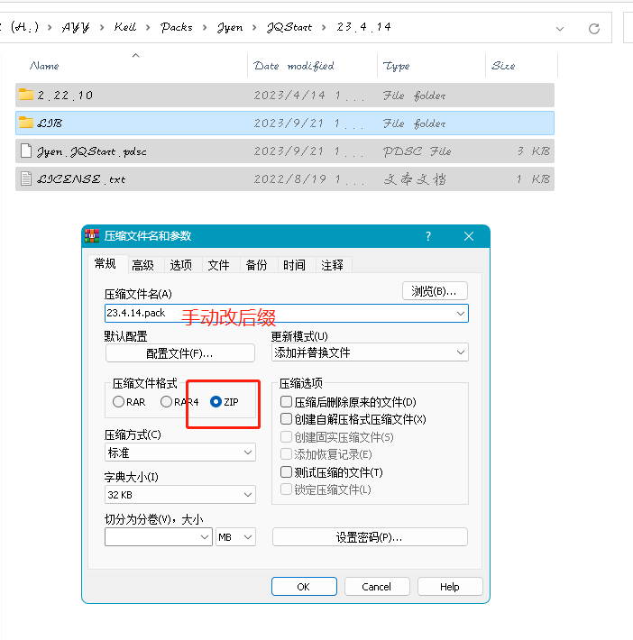
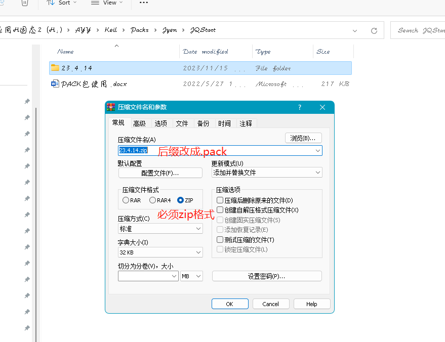
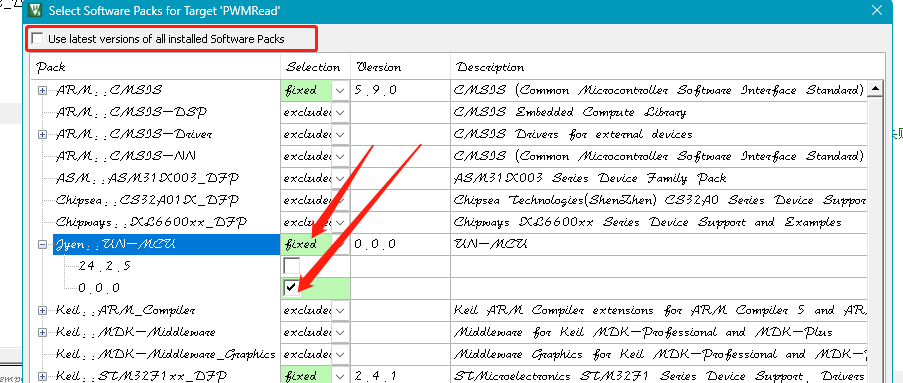

# UN-MCU （企鹅群号8646015551 答案：1）

#### 介绍
统一MCU  驱动层和外设层API   因项目需求 mcu被经常更换/不同项目使用不同MCU 导致业务代码需要重构    这边将多MCU进行封装一层进行统一接口调度  仅更换MCU的项目业务逻辑层无需更改  只需要修改配置文件即可 新的项目若同事也·按照接口封装了该型号mcu 则新建工程直接用
目前已部分封装STM32、杰发科技、芯旺微、赛腾微的驱动只封装我用到的部分  后面应该是华大、灵动微了 更多的是需要大家一起努力 这样以后有新的传感器来了我们就不要重复去网上找驱动代码移植 哪怕换了新单片机我只需要映射驱动过去 其他代码不用管 
#### 注意事项  
因为这个主要本来用所以存在很多不完善地方
RTThread虽然也做了中间层 但是那个可能我不会使用把 不然可以将我的集成上去  以下没集成原因纯属个人理解
首先我没在正式项目用过他，我觉得他用接口是通用但是需要调用时候传一致的参数进去，而我用的是枚举类优先错了编译器会报错
另外我觉得听他的工程比较大而且涉及到内核很多东西我不懂  我想的是裸机可控性高  当然我这个改改也能兼容os的 但是我没有相关项目 平常做的东西都很简单
这个项目主要是抛转引玉 有经验的帮忙完善或者是集成到已有的开源项目
 1.IAR没测试
 2.OS没测试
 3.我所有用到的功能比较少 接口地方还需要扩展

#### 安装教程

1.  将所有文件拷贝到pack包文件夹 或者压缩成zip把后缀改成pack就可以双击安装成pack/导入到IAR 
(这里方法是安装法)修改驱动后会影响所有项目 如果想隔离单独拉源码添加到项目或使用时限定版本（推荐）
 注意目录结构不要嵌套即在版本下面去打包

错误示例 目录结构嵌套  在外面打包的 会导致keil无法识别

#### 使用说明（这里以keil示例 分支中有单独的demo拿来就用 也有相关说明）

1. 添加到现有项目

勾选后就会出现项目源码

这里以STM32 cubemx生成的代码调用为例
引脚定义到配置文件.h中（这是为了方便业务分离 换了mcu只需要修改对应.c   这里自己手动新建  后面使用该库时自动创建）

实现一下

引脚映射

业务中调用

 例如板载外设ads115和sht30/sht3x 只需要映射引脚配置参数就可以用了  内部调用了模拟iic

 
####文件目录树

 

#### 特技

1.   板内支持的在HAL中能看到最新的   （也封装了个模拟IIC和bootloader的）目前首次更新的如下

2.板外外设在 FML文件夹中 jfml.h中查看的到引用  如果路径/文件报错就是更新时候没适配/早期一些东西拉进来暂时没用到就没适配

 

3.工具库就没啥了

#### 如何协作  有经验的也可以帮忙优化或者重构 
1.片内外设的新增

在HAL目录下找到目标mcu  新建该mcu文件夹 大的参考目录下STM32实现即可  主要是mcu型号和cubemx自动生成的对上  如果其他没有自动生成的工具  以其官方宏定义定义优先  没有的则自定义 最后将目标.c链接到jqstart.c中   .h添加到jhal.h中

2.板载外设的新增

参考FML/THTB/SHTxx/sht3x.c和FML/adc/ads1115的实现 
最后将目标.c链接到jqstart.c中   .h添加到jfml.h中

3.工具类新增
在做上两步时像crc校验或数学公式等常用的自己写的或第三方库 只要不仅仅应用到上面的
可以 添加到Util中  实际步骤也和上面差不多

虽然看起来也会是整个包变大 但是不调用不编译所以自然是越多越好  
由于驱动内部一般不会去改了尽量以性能优化+注释优先 没必要调用用起来简单但是比较重的库   导致编译时候无关的东西太多 
另外尽量不要涉及栈 这个原则是拿来就用不需要额外配置 内部用了mymalloc 使用数组当做内存做一些轻量级的变量
malloc哪怕释放似乎也有内存碎片  使用cjson时候久了就宕机  总的来说让代码尽量可控 哪怕你的项目中ok的 别人拿了你的代码也可以检查一下

 
